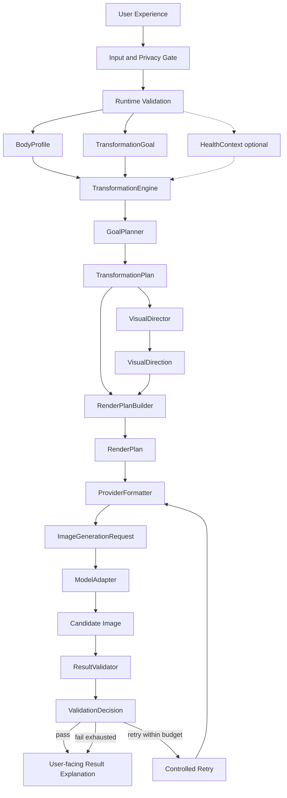

# HelseApp AI OS v2.0

Version: 2.0  
Status: Approved architecture — implementation staged  
Authority: [HelseApp AI Constitution](./00_AI_CONSTITUTION.md)  
Related: [Sprint 1 Completion](./01_SPRINT_1_COMPLETION.md), [Model Adapter](./02_MODEL_ADAPTER.md), [Visual Director](./03_VISUAL_DIRECTOR.md), [Migration Roadmap](./05_AI_OS_V2_MIGRATION_ROADMAP.md)

## 1. Executive principle

> HelseApp owns the transformation intelligence.  
> External models render an approved, structured transformation.

No image provider, prompt formatter, UI component, or retry process may redefine the approved transformation.

This restates the Constitution's permanent rule: the image model never decides the transformation. HelseApp calculates it; the model only visualizes it. AI OS v2.0 makes that rule operational across every layer from input gate to result presentation.

## 2. Complete system flow

Canonical end-to-end flow:

1. User Experience  
2. Input and Privacy Gate  
3. Runtime Validation  
4. BodyProfile  
5. TransformationGoal  
6. Optional normalized HealthContext  
7. TransformationEngine  
8. GoalPlanner  
9. TransformationPlan  
10. VisualDirector  
11. VisualDirection  
12. RenderPlanBuilder  
13. RenderPlan  
14. ProviderFormatter  
15. ImageGenerationRequest  
16. ModelAdapter  
17. Candidate Image  
18. ResultValidator  
19. ValidationDecision  
20. Controlled Retry or Approved Result  
21. User-facing Result Explanation  



**Migration note:** Until RenderPlan is production-cutover, Sprint 1–2 paths may still use `PromptBuilder` → `PromptPackage` → `ModelAdapter` (see §6). Production today remains on legacy `lib/visuellPrompt.js` / Replicate and is unchanged by this document.

## 3. Architectural layers

### User Experience

**Owns:**

- onboarding
- goal collection
- image selection
- user-facing progress
- result explanation

**Must not:**

- calculate physiology
- build prompts or RenderPlans
- store provider secrets
- bypass runtime validation

### Input and Privacy Gate

**Owns:**

- consent status
- input normalization
- image metadata cleanup policy
- retention policy hooks
- boundary validation before domain construction

**Must not:**

- calculate transformation outcomes
- call image models

### Domain Layer

**Contracts:**

- `BodyProfile`
- `TransformationGoal`
- `HealthContext` (normalized, optional)
- `TransformationPlan`

**Rules:**

- no provider payloads
- no React / Expo types
- no transport concerns
- versioned schemas
- optional unknown values remain unknown (never silently invented as known facts)

### Transformation Intelligence

**Components:**

- `TransformationEngine`
- `GoalPlanner`
- shared progress curve (`progressCurve` / Constitution diminishing-returns rule)
- physiology rules
- regional allocation rules
- reliability policy

**Owns:**

- what may change
- magnitude or range
- timeline
- assumptions
- warnings
- estimate reliability

**Must not:**

- build prompts or RenderPlans
- choose providers
- access images
- perform network requests

### Visual Direction

**Components:**

- `VisualDirector`
- `VisualDirection`

**Owns:**

- presentation style
- visual visibility / change emphasis
- source-faithful photographic treatment
- anatomical and realism emphasis derived from the plan

**Must not:**

- calculate new body changes
- introduce unapproved regions
- invent measurements
- choose provider parameters (seeds, steps, model IDs, denoise)

Permanent rule (aligned with [03_VISUAL_DIRECTOR.md](./03_VISUAL_DIRECTOR.md)):

> TransformationEngine decides what changes.  
> VisualDirector decides how those approved changes are visually emphasized.

### Render Planning

**Components:**

- `RenderPlanBuilder`
- `RenderPlan`

**Owns:**

- structured provider-neutral rendering instructions
- preservation rules
- approved visual changes
- anatomy constraints
- realism constraints
- exclusions
- trace metadata

**Must not:**

- contain provider-specific syntax
- perform network requests
- recalculate physiology

### Provider Formatting

**Components:**

- `FluxFormatter` (and/or Replicate/Flux family formatter)
- `GPTImageFormatter`
- `ImagenFormatter`
- future provider formatters

**Owns:**

- translating `RenderPlan` into provider-compatible prompt text and fields
- provider-specific prompt conventions
- supported aspect-ratio mapping
- provider capability adaptation (with explicit warnings when capabilities differ)

**Must not:**

- add new transformation goals
- increase visual intensity beyond the plan / direction
- weaken identity or anatomy constraints
- invent measurements

### Model Adapter

**Components:**

- `ModelAdapter`
- `ReplicateAdapter`
- future OpenAI and Google adapters
- `ModelRegistry`

**Owns:**

- request transport
- authentication on the server
- provider response normalization → `ImageGenerationResult`
- timeout and cancellation
- provider metadata

**Must not:**

- own product prompts or RenderPlan policy
- calculate transformation or visual direction
- expose secrets to clients

See [02_MODEL_ADAPTER.md](./02_MODEL_ADAPTER.md).

### Result Quality Gate

**Components:**

- `ResultValidator`
- `IdentityValidator`
- `AnatomyValidator`
- `PlanAdherenceValidator`
- `PhotorealismValidator`
- `SafetyValidator`

**Owns:**

- pass / fail / retry decision (`ValidationDecision`)
- machine-readable validation findings
- controlled retry recommendations

**Must not:**

- silently approve failed identity
- increase physiology beyond the plan
- bypass privacy or safety policy

Aligns with Constitution §11 (image validation dimensions).

### Result Presentation

**Owns:**

- before/after presentation
- assumptions
- reliability communication
- disclaimer
- explanation of the AI plan

**Must not:**

- call the image a guarantee or medical prediction

## 4. Core data contracts

Conceptual contracts (ownership and mandatory characteristics). This section does **not** redefine current TypeScript interfaces line-by-line.

| Contract | Ownership | Mandatory characteristics |
| --- | --- | --- |
| `RawUserInput` | UX / gate boundary | Untrusted; may be incomplete; never treated as validated domain |
| `ValidatedUserInput` | Runtime validation | Explicit errors on invalid data; warnings for unusual-but-permitted input |
| `BodyProfile` | Domain | Versioned schema; no provider or UI types; unknowns stay unknown |
| `TransformationGoal` | Domain | User intent only; not a physiological calculation |
| `HealthContext` | Domain (optional) | Normalized wearable/health signals; no Terra/provider payload leakage |
| `TransformationPlan` | Transformation intelligence | Structured estimates, ranges, regions, intensity, assumptions, warnings, reliability, rules/schema versions |
| `VisualDirection` | Visual direction | Presentation-only; derived from plan fields; deterministic for identical inputs |
| `RenderPlan` | Render planning | Provider-neutral structured rendering intent; preferred long-term contract (see §5) |
| `PromptPackage` | PromptBuilder (legacy-compatible) | Model-independent prompt sections + metadata; preserved during migration (see §6) |
| `ImageGenerationRequest` | Adapter boundary | Carries rendering payload (today `PromptPackage`; later formatter output / RenderPlan-derived fields) plus aspect ratio, seed, quality, style, opaque `providerOptions` — no secrets or provider API IDs |
| `ImageGenerationResult` | Adapter boundary | Normalized success/failure, image URL, provider/model metadata, timings, warnings |
| `ValidationDecision` | Result quality gate | Pass / fail / retry; findings; retry recommendations within policy |
| `FutureYouResult` | Result presentation | User-facing artifact: approved image reference, plan summary, assumptions, reliability language, disclaimer |

## 5. RenderPlan architecture

`RenderPlan` is the preferred provider-neutral rendering contract for AI OS v2.0.

### Conceptual sections

| Section | Intent |
| --- | --- |
| `source` | Source-image fidelity anchors (pose, camera, lighting, background, clothing as applicable) |
| `identity` | Same-person constraints (face, age appearance, hair, skin tone, marks, frame) |
| `scene` | Photographic / documentary presentation from `VisualDirection` |
| `transformation` | Approved visual changes only — magnitudes and regions from `TransformationPlan` |
| `anatomy` | Skeletal and limb constraints; proportional muscle development |
| `realism` | Photorealism and anti-caricature constraints |
| `exclusions` | Explicit negatives (impossible anatomy, identity drift, glamour stereotypes, etc.) |
| `trace` | Schema/rules versions, plan references, direction metadata, builder version |

### Permanent rule

> RenderPlan contains structured instructions.  
> It does not contain a provider-ready prompt as the source of truth.

Provider-ready prompt text is a **derived artifact** created by a `ProviderFormatter`.

## 6. PromptPackage compatibility

- `PromptPackage` remains supported during migration.
- Current `buildPromptPackage` and `buildDirectedPromptPackage` remain unchanged by this architecture demand.
- No breaking removal of `PromptPackage` until production uses `RenderPlan`.
- `PromptPackage` may temporarily be generated from `RenderPlan` (bridge) so adapters and harnesses continue to work.
- New business rules must **not** be added to legacy `PromptBuilder`; evolve rules via engine, VisualDirector, and RenderPlanBuilder.
- Provider formatters replace long-term direct prompt construction for production image calls.
- Production `lib/visuellPrompt.js` stays unchanged until an explicit cutover demand.

## 7. Provider independence

- Only provider formatters and adapters know provider details.
- Replicate is **transport**, not the product architecture.
- Flux (or any model) is **one renderer**, not the transformation engine.
- Switching provider must not change `TransformationPlan`.
- Provider capability differences must produce explicit warnings (never silent weakening of identity, anatomy, or plan adherence).
- Provider-specific IDs, version hashes, and API tokens must not appear on domain contracts or client code.

## 8. Retry architecture

Controlled retry loop:

```
Candidate image
  → validation findings
  → retry policy
  → approved adjustment
  → formatter
  → adapter
  → new candidate
```

**Retry may adjust:**

- provider
- model tier
- wording emphasis (formatter-level, not plan magnitude)
- supported rendering parameters (within capability policy)
- timeout strategy

**Retry may not adjust:**

- target body-fat plan
- fat-loss range
- muscle-gain range
- approved regions
- timeline
- skeletal constraints
- identity requirements

**Finite retry budget:** implementations must define a hard cap (product default to be set in the Result Validator demand). Exhausted budget → `exhausted_retry_budget` and a user-safe failure/partial path — never unbounded loops and never physiology escalation.

## 9. Versioning and traceability

Require version fields (or equivalent trace metadata) for:

- BodyProfile schema
- TransformationGoal schema
- TransformationPlan schema
- physiology rules (`TRANSFORM_RULES_VERSION` and successors)
- VisualDirection schema / rules
- RenderPlan schema / rules
- formatter version
- adapter / provider / model metadata
- validator rules
- final result record (`FutureYouResult` / persistence when introduced)

Deterministic layers (`TransformationEngine`, `GoalPlanner`, shared progress curve, `VisualDirector`, `RenderPlanBuilder`) must be reproducible for identical validated inputs and identical rule versions, excluding explicitly non-deterministic metadata such as timestamps (Constitution §15).

## 10. Privacy architecture

- API tokens server-side only
- no Base64 image logging
- no raw health-payload logging
- no model prompts containing unnecessary personal data
- metadata stripping policy before provider upload where feasible
- retention and deletion controls (explicit when storage is introduced)
- short-lived provider URLs where possible
- trace IDs rather than sensitive payloads in logs
- explicit consent before health-device connection
- provider data minimization
- wearable data optional for core visualization (Constitution §12)

## 11. Error model

| Category | Typical origin |
| --- | --- |
| `validation_error` | Runtime / boundary validation |
| `privacy_error` | Consent, retention, or data-minimization violation |
| `planning_error` | Engine / planner cannot produce a safe plan |
| `formatting_error` | ProviderFormatter failure or unsupported capability |
| `provider_error` | Upstream API / transport failure |
| `timeout_error` | Adapter timeout or cancellation |
| `safety_error` | Safety validator or policy block |
| `identity_validation_error` | Identity gate failure |
| `anatomy_validation_error` | Anatomical plausibility failure |
| `plan_adherence_error` | Result does not follow TransformationPlan |
| `exhausted_retry_budget` | Retries spent without an approved candidate |

Errors must be machine-readable internally and user-safe externally (no secret leakage, no shame-based copy).

## 12. Observability

**Allow logging of:**

- trace ID
- layer
- duration
- version metadata
- provider status
- validation scores / bands (non-identifying)
- retry reason
- non-sensitive error codes

**Forbid logging of:**

- API keys
- Base64 images
- raw body images
- raw health payloads
- full identifying prompts
- sensitive user notes unless explicitly sanitized

## 13. Testing strategy

- unit tests for deterministic domain layers
- contract tests between adjacent layers (already started in `pipelineContract`, model adapter, VisualDirector tests)
- formatter snapshot tests
- adapter transport tests with mocked networks
- validator fixture tests
- integration harness before production cutover
- privacy / logging tests
- regression image suite for approved internal test images
- end-to-end staging tests

No production integration is complete while typechecking or relevant tests fail (Constitution §16).

## 14. Production cutover rules

No direct cutover to the entire user base.

Required sequence:

1. non-production integration harness  
2. shadow execution beside the current pipeline  
3. compare legacy and v2 outputs  
4. internal test cohort  
5. feature flag  
6. small staged rollout  
7. quality and cost review  
8. broader rollout  
9. rollback plan retained  

## 15. Forbidden shortcuts

Explicitly forbid:

- UI calling Replicate directly
- frontend API tokens
- provider prompts deciding physiology
- adapter mutating `TransformationPlan`
- `VisualDirector` inventing measurements
- formatter weakening identity constraints
- retries escalating beyond the approved plan
- accepting an image based only on HTTP success
- silent defaulting of missing body measurements as known facts
- logging sensitive body images or Base64 payloads

## 16. Definition of done for AI OS v2

AI OS v2 is production-complete only when:

- all layer contracts exist
- deterministic engine tests pass
- `RenderPlan` is implemented
- at least one provider formatter exists
- one server-side adapter is production-integrated
- result validation is active
- privacy controls are documented and tested
- feature-flag rollout exists
- observability avoids sensitive data
- rollback is verified
- user-facing uncertainty is clear

This documentation demand alone does **not** constitute production completion.

## 17. Permanent architecture statement

> TransformationEngine decides what may change.  
> VisualDirector decides how approved changes are emphasized.  
> RenderPlanBuilder structures the rendering intent.  
> ProviderFormatter translates intent for a specific model family.  
> ModelAdapter transports the request.  
> ResultValidator decides whether the candidate is acceptable.  
> No later layer may redefine an earlier layer's authority.