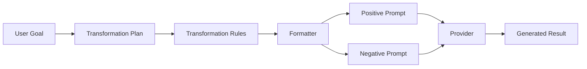

# Internal AI OS v2 Image Preview

Status:  
Internal paid-provider visual-quality laboratory

Authority: [HelseApp AI Constitution](./00_AI_CONSTITUTION.md)  
Architecture: [AI OS v2.0 Architecture](./04_AI_OS_V2_ARCHITECTURE.md)  
Related: [AI OS Runtime](./13_AI_OS_RUNTIME.md), [Replicate Transport Adapter](./11_REPLICATE_TRANSPORT_ADAPTER.md), [Result Validator](./10_RESULT_VALIDATOR.md), [AI OS Control Room](./16_AI_OS_CONTROL_ROOM.md)

## Purpose

Give an authorized developer a controlled way to generate **one** AI OS v2
preview image from an allowlisted fictional scenario plus a temporary source
photograph, then inspect plans, formatter output, stages, validation, and
provider metadata side by side with the source.

This is an internal visual-quality laboratory. It is not public production
generation, onboarding, wearable integration, medical prediction, batch
generation, automatic retry experimentation, or a production cutover.

## Architecture

```
Control Room browser
→ authorized internal preview API
→ allowlisted fictional scenario
→ temporary source image validation
→ AiOsRuntime (transport_mock + injected ReplicateTransportAdapter)
→ TransformationPlan
→ VisualDirection
→ RenderPlan
→ Provider Formatter
→ one provider request
→ ResultValidator (provisional evidence until vision adapter exists)
→ safe preview projection
→ Control Room image comparison
```

Runtime note: AI OS Runtime currently exposes `dry_run` and `transport_mock`.
Internal live preview uses `transport_mock` with a real (or test-fake)
`ReplicateTransportAdapter`. That is the supported single-cycle live contract —
no parallel runtime is invented.

Production ownership remains:

`api/generate-future-you.js` → `lib/replicate.js` → existing image flow

Preview uses a separate endpoint only: `api/ai-os-image-preview.ts`.

## Feature flags

Document names only (never values):

- `AI_OS_IMAGE_PREVIEW_ENABLED`
- `AI_OS_IMAGE_PREVIEW_MAX_REQUESTS_PER_HOUR`
- `AI_OS_IMAGE_PREVIEW_MODEL`
- `REPLICATE_API_TOKEN`
- `AI_OS_CONTROL_ROOM_ACCESS_KEY`

Enabled only when `AI_OS_IMAGE_PREVIEW_ENABLED` is exactly `1`. Default is
disabled. Preview stays off until the owner manually adds the flag.

Hourly cap defaults to `3` (min `1`, max `10`; invalid → `3`).

Model uses transport default unless `AI_OS_IMAGE_PREVIEW_MODEL` is a valid
owner/name override. The browser never supplies a model name.

Authentication reuses the Control Room access key header
`X-AI-OS-Control-Room-Key` (SHA-256 timing-safe compare). No second browser key
system.

## Privacy model

- source image stays in browser memory before submission
- source image is sent to the HelseApp preview API after Generate
- source image may be sent to the configured provider
- HelseApp does not persist it
- the provider may process it under its own retention terms
- the submitter confirms adult status and consent
- no image is stored in browser persistent storage
- no database storage
- no filesystem persistence
- no HelseApp object-storage upload
- no logs containing image content or Base64
- no analytics
- no cache of source images
- no request-body logging of images
- no source image in error responses or telemetry
- no `localStorage` / `sessionStorage` / cookies for images or confirmations
- browser image state and confirmations cleared on Lock and page refresh

Do not claim provider zero-retention unless proven by provider configuration.

## Adult-only use

Internal preview is adult-only. Generate requires an explicit confirmation:

> I confirm that every person shown is at least 18 years old.

The POST body must include `adultConfirmed: true` as a literal boolean.
Missing, `false`, `"true"`, or numeric truthy values are rejected.

## Consent requirement

Generate also requires:

> I confirm that I am the person shown, or that I have explicit permission from
> the adult person shown to use this image.

The POST body must include `consentConfirmed: true` as a literal boolean with
the same strict acceptance rules. Confirmations are never stored in
`localStorage`, `sessionStorage`, or cookies, and are cleared on Lock and
refresh.

## Supported clothing

HelseApp supports clearly adult, consented body-progress source photos,
including ordinary underwear, sports bras, swimwear, fitted athletic clothing,
and training shorts.

Clothing or underwear style alone must never determine whether an image is
interpreted as sexual. The Control Room guidance must not say underwear is
prohibited. An external provider may still decline some compliant images.

## Original presentation (PATCH 017C)

Internal body-progress previews treat the submitted photograph as the source of
truth for pose, facial expression, camera framing, clothing, underwear style,
swimwear, styling, confidence, attractiveness, glamour, background, and
lighting.

Only the requested health and body-progress transformation may change.

The AI OS formatter preview safety context must:

- preserve original presentation and visual character
- preserve existing clothing and clothing coverage (no redesign/remove/replace
  except a minor natural fit adjustment for the transformed body)
- limit edits to approved plan body characteristics
- not classify underwear, swimwear, sports bras, or training clothing as sexual
  merely by garment type
- not estimate age from appearance (the adult confirmation is primary)
- not judge why the photograph was taken, attractiveness, pose, or glamour
- use one narrow content boundary: do not introduce explicit pornographic
  content absent from the source image

## Disallowed content

Not accepted for preview:

- introducing explicit pornographic content absent from the source
- image submitted without subject consent
- third-party image without authorization
- missing adult confirmation (user declaration is primary; AI must not
  estimate age from appearance)

Provider moderation remains separate and may still decline some images.

## Provider limitations

External providers may still reject legitimate adult underwear or fitness
images. Patch 017C updates formatter presentation-preservation wording only; it
does not alter provider moderation, the provider model, transport, runtime, or
production generation. Provider/model evaluation with approved adult, consented
test images belongs in Demand 018.

HelseApp currently relies on explicit adult/consent/billing confirmations and
provider moderation (plus formatter presentation-preservation context from
PATCH 017C). Dedicated image-based age/content moderation is not yet
implemented.

## Provider safety cannot be bypassed

Provider moderation remains enabled. Preview must not disable, circumvent,
obfuscate, auto-retry, or silently switch models to evade a safety block.
A `provider_safety_blocked` result is terminal.

For `black-forest-labs/flux-kontext-pro`, the documented safety input is
`safety_tolerance` (0–6; max **2** when `input_image` is set). Preview already
uses `2` and must not invent unsupported fields such as
`disable_safety_checker`.

## Billing guard

Generate requires an explicit checkbox:

> I understand that this creates one paid AI provider request.

The POST body must include `billingConfirmed: true` as a literal boolean.
Missing, `false`, `"true"`, or numeric truthy values are rejected.

Generate requires all three literal booleans together:

- `adultConfirmed: true`
- `consentConfirmed: true`
- `billingConfirmed: true`

No provider request starts before these checks succeed. The server validates
them before loading the heavy runtime, constructing transport, contacting
Replicate, or consuming the hourly allowance.

## Request cap

Best-effort in-memory hourly cap keyed by a SHA-256 digest of the access
context (never the raw key, never raw IP in responses/logs).

Serverless instances may each keep separate memory. This is a billing guard,
not strong distributed security.

The hourly paid-request allowance is consumed only immediately before the
provider request path begins (after confirmations and source-image validation).
It is not consumed for missing adult/consent/billing confirmation, malformed
body, invalid image, unauthorized request, or disabled preview. A provider
safety-blocked request may count because the external provider may have
received it.

Also enforced in the browser:

- one Generate request in flight
- no parallel Generate clicks
- no automatic retry
- no batch endpoint
- exactly one provider output per accepted request

Exceeded cap → HTTP `429` / `preview_rate_limited`.

## Source-image lifecycle

1. Browser selects JPEG/PNG/WebP.
2. Canvas redraw (max long edge 1600, JPEG ~0.85, no upscale) strips EXIF.
3. Data URI held in memory only.
4. POST to internal preview API after billing confirmation.
5. Server re-validates MIME, magic bytes, and ≤ 5 MB decoded size.
6. Image is passed once into AI OS transport as `data_uri`.
7. Browser clears on Lock/refresh; server does not persist.

Rejected: SVG, GIF, HEIC (no converter), PDF, video, multiple images, remote
URL, malformed Base64, empty, oversized, MIME mismatch.

## Generated-image lifecycle

- one temporary HTTPS provider URL may appear in the authorized preview result
- marked `expiresOrIsTemporary: true`
- openable in a new tab when HTTPS
- no download/share/gallery persistence by HelseApp
- not returned when projection sanitizer detects unsafe content

## Provider processing notice

The source image may be transmitted only to:

browser → HelseApp internal preview API → configured AI provider

The external provider may process the source image according to its own
configured retention and privacy terms. Do not claim zero provider retention
unless proven by provider configuration.

## Validation behavior

After the single transport call, ResultValidator runs with provisional
deterministic evidence (preview laboratory). Real vision analysis is deferred.
Acceptance or rejection is projected safely. Validation rejection does not
trigger another provider call.

## No automatic retry

Even when RetryOrchestrator would recommend retry:

- Demand 017 makes at most one provider request
- retry decisions are informational only
- the browser must not silently retry
- the operator may manually submit a new paid request after reviewing the result

## What remains unchanged

- `api/generate-future-you.js`
- `lib/replicate.js`
- `lib/visuellPrompt.js`
- `lib/transformasjonLogikk.js`
- `public/index.html`
- Control Room dry-run unlock and scenario dry-run
- ProductionRuntimeGateway / Shadow Runtime ownership
- public HelseApp user experience

## What this milestone proves

- AI OS v2 can drive one authorized internal live preview
- Control Room can compare source vs generated output
- plans, formatter prompts, stages, validation, and safety are inspectable
- billing confirmation and request cap gate paid traffic
- production generation path stays untouched
- preview defaults to disabled

## What this milestone does not prove

- final identity / anatomy / realism quality for public release
- production cutover readiness
- distributed rate limiting
- real vision-based ResultValidator evidence
- provider retention configuration
- unlimited or batch preview capacity

## Manual activation

Owner actions required (not automated by this demand):

1. Set Production env `AI_OS_IMAGE_PREVIEW_ENABLED=1`.
2. Ensure `AI_OS_CONTROL_ROOM_ACCESS_KEY` and `REPLICATE_API_TOKEN` are set.
3. Optionally set `AI_OS_IMAGE_PREVIEW_MAX_REQUESTS_PER_HOUR` and
   `AI_OS_IMAGE_PREVIEW_MODEL`.
4. Redeploy Production.
5. Unlock Control Room, select scenario, upload photo, confirm adult + consent +
   billing, Generate.

Do not automatically create or alter Vercel environment variables from agents.

## Manual verification checklist

- Control Room unlock still works
- Dry-run scenario still works
- Preview returns disabled without the flag
- With flag: one confirmed request produces one preview
- Source cleared on Lock
- No secrets visible in UI JSON
- No automatic retry after provider/validation failure

## Vercel runtime packaging (PATCH 017A)

Vercel Node cannot execute the `../src/**` TypeScript AI OS graph via runtime
`import()` / `require()` of `.ts` barrels (`ERR_UNSUPPORTED_DIR_IMPORT` on paths
such as `../runtime`). Internal preview therefore ships a **prebundled CJS**
artifact:

`src/ai/control-room/imagePreviewRuntime.bundle.cjs`

Built with:

`npm run build:ai-image-preview-runtime`

`api/ai-os-image-preview.ts` requires that artifact only after feature flag,
auth, billing confirmation, and request validation. Auth/disabled paths return
identified JSON without loading the heavy graph. Rebuild and commit the bundle
whenever `ImagePreviewService` or its AI OS dependency graph changes.

Safe authorized `diagnostic` values on failure responses:

- `module_load_failed`
- `module_shape_invalid`
- `service_construct_failed`
- `runtime_execute_failed`
- `provider_failure`
- `provider_timeout`
- `provider_invalid_input`
- `provider_auth_error`
- `provider_http_error`
- `provider_safety_blocked`
- `provider_invalid_response`
- `provider_network_error`
- `token_missing`
- `validation_failed`
- `projection_failed`

Missing / empty `REPLICATE_API_TOKEN` maps to HTTP `502` / `provider_failure`
with diagnostic `token_missing` (not an opaque `runtime_failure`).

Preview provider wiring (PATCH 017B/C):

- Vercel function `maxDuration: 120` and `bodyParser.sizeLimit: 10mb`
- Preview transport create timeout `60s`, total timeout `120s` (data-URI upload budget)
- Replicate create uses short `Prefer: wait` (≤12s, same order as working Flux path) plus poll
- Flux create body aligns with working path: `input_image`, `aspect_ratio` (supported or
  `match_input_image`), `output_format: png`, `safety_tolerance: 2`
- Node/undici abort and timeout-like `fetch failed` errors map to `provider_timeout`
  (not opaque `provider_failure`)
- E005 / safety prediction failures map to `provider_safety_blocked`
- Transport failure codes map to the diagnostics above (still one provider call, no retry)

## Current limitations

- provisional ResultValidator evidence (no vision adapter yet)
- in-memory rate cap is per serverless instance
- Vercel request body size may constrain large uploads (browser compresses first;
  API raises the parser limit to 10mb for preview)
- preview runtime is prebundled CJS (rebuild after AI OS graph changes)
- paid provider verification still requires owner browser confirmation
- external providers may still reject legitimate adult underwear images
- HelseApp currently relies on explicit confirmations and provider moderation
- dedicated image-based age/content moderation is not yet implemented
- lightweight preflight checks confirmations/MIME/size/fields only — not pixel
  classification of age, consent, nudity, or sexualization
- Demand 018 must evaluate provider/model compatibility using approved adult,
  consented test images
- Demand 018A Prompt Isolation Lab diagnoses prompt-vs-image safety blocks;
  it does not change moderation, model, transport, or production ownership

## Prompt Isolation Lab

Demand 018A adds a **manual** Prompt Isolation Lab inside the Control Room
internal preview panel. It diagnoses whether `provider_safety_blocked` outcomes
are driven by formatted prompt wording rather than image, model, transport, or
moderation settings.

Four browser-allowlisted variants only (no arbitrary prompt text):

| Radio | Variant | Prompt construction |
| --- | --- | --- |
| A | `minimal` | Concise server-built diagnostic prompt adapted from scenario timeline/goal. Narrow **non-production** exception (`minimal_bypasses_structured_formatter`): bypasses structured AI OS formatter sections via `promptIsolationDiagnostic: "minimal"` + `degraded_structure`. No pornography/sexual/underwear/adult/consent/moderation/safety-filter wording. |
| B | `current_ai_os` | Control — full current AI OS formatter path including PATCH 017C `previewSafetyContext`. Default. |
| C | `current_without_preview_context` | Same plan/direction/render/formatter/version as B, but omits only `previewSafetyContext`. |
| D | `pre_017c_baseline` | Same formatter contract with typed diagnostic context `previewSafetyContext: "pre_017c_baseline"`. SAFETY positive/negative wording is the versioned constant captured from `FluxFormatter.ts` at commit `10f07b4d12a9e40ed5b878830dbf0f9639fd1d2e` (immediate parent of PATCH 017C commit `a66ad34`). No full formatter fork; no runtime git reads. |

Same conditions for every variant: source image, scenario, provider,
`ReplicateTransportAdapter`, model, dimensions, one output, transport timeouts,
billing/auth/rate-limit gates. Only prompt construction differs. Scenario seeds
remain applied when present (`FormatterOptions.seed` → transport); provider
nondeterminism can still occur.

UI: section **Prompt Isolation Lab**, radios A–D (default B), button
**Generate one diagnostic preview**, paid-request notice, billing confirmation
each time, disable while in flight, hourly rate limit applies. No Run All, no
auto cycle/retry. Displays variant, prompt source, formatter name/version,
model, request ID, outcome, diagnostic, prediction ID, generated image, and
positive/negative prompts via `textContent` only. Never tokens, keys, raw
provider payloads, headers, source data URIs, stacks, or env values.

Safety block mapping stays: HTTP `502` / `provider_failure` + diagnostic
`provider_safety_blocked` + selected `promptIsolation` variant summary. No raw
moderation text. No moderation bypass.

Legal/onboarding policy text stays out of provider prompts (confirmations remain
API gates only).

## AI Experiment Lab

Demand 018E names the parent Control Room feature **AI Experiment Lab**.
Prompt Isolation remains one module inside it. Prompt Isolation variant IDs are
unchanged (`minimal`, `current_ai_os`, `current_without_preview_context`,
`pre_017c_baseline`).

The lab is internal-only. It does not affect public production generation, does
not persist personal images, and never makes automatic paid provider requests.

## Prompt experiment history

Demand 018D adds **session-only** experiment history. Demand 018E extends each
record with a full `pipelineInspector` snapshot (Transformation Rules, rule
provenance, version metadata, formatter, prompts, provider, result, and a
reserved evaluation placeholder). There is **one** history system — no parallel
store.

- stored only in current page memory (JavaScript array)
- maximum **20** records (FIFO — oldest dropped when exceeded)
- cleared on Control Room **Lock** and on page **refresh**
- never written to `localStorage`, `sessionStorage`, IndexedDB, or cookies
- never sent to analytics or a HelseApp persistence API
- never includes source images, source data URIs, access keys, provider tokens,
  raw provider responses, generated image URLs, or environment values
- may include formatted positive/negative prompts (authorized internal tool)

History is appended only after the owner manually completes an existing
Prompt Isolation Lab request. One manual click remains one provider request
maximum. No Run All, queue, auto-retry, or scheduled experiments.

## AI Pipeline Inspector

Read-only accordion inspector for a selected history record. Order:

1. Goal
2. Transformation Plan
3. Transformation Rules (open by default)
4. Rule Provenance
5. Formatter
6. Prompts
7. Provider
8. Result

Uses native `<details>` / `<summary>`. Dynamic content uses `textContent` only.
Compact version badges show AI OS, Pipeline, Transformation Rules, and
Formatter versions (`Unavailable` when null).

The inspector never edits rules, never regenerates from edited rules, and never
contacts a provider.

### Architecture

```text
User Goal
  → Transformation Plan
  → Transformation Rules   ← canonical intent
  → Formatter
  → Positive Prompt        ← derived artifact
  → Negative Prompt        ← derived artifact
  → Provider
  → Generated Result
```



## Transformation Rules

Transformation Rules are the canonical representation of HelseApp intent.
Prompts are provider-specific generated artifacts.

Rules are projected deterministically from existing structured AI OS artifacts:

- scenario / goal (when available)
- `TransformationPlan`
- `VisualDirection`
- `RenderPlan`
- typed formatter options (name/version/mode only)

Display groups: Identity, Pose, Camera, Background, Lighting, Clothing, Body
composition, Body region emphasis, Proportions, Realism, Timeline, Priority
order.

Unknown fields are `null` — never invented. Prompt text is never parsed to
reconstruct rules. No parallel rule engine and no generation-pipeline changes.

## Rule Provenance

Each displayed rule may carry deterministic provenance:

- `rulePath` (e.g. `identity`, `timeline`)
- `source` (`scenario` | `profile` | `goal` | `transformation_plan` |
  `visual_direction` | `render_plan` | `formatter_option` | `derived`)
- `sourcePath` — safe contract path (never a filesystem path, never stacks)

Provenance is omitted when unknown. `derived` is used only for direct
deterministic projections of multiple structured values.

## Version metadata

Each `pipelineInspector` snapshot records:

- AI OS version (runtime rules version when available)
- Pipeline version (`1.0` inspector pipeline)
- Transformation Rules version
- Formatter name / version
- Render plan version
- Validation version when available

Null → UI shows `Unavailable`.

## Accordion pipeline view

Native accessible accordion inside AI Experiment Lab. Transformation Rules open
by default; other sections collapsed. Formatter section shows name / version /
mode only. Prompts section shows positive/negative text plus metrics and the
canonical note that prompts are derived artifacts.

## Rule comparison

When comparing two experiments, Transformation Rules are compared **before**
prompts via flattened exact-value path diffs:

- added / removed / modified / unchanged
- no semantic interpretation, no causality, no better/worse labels
- ignore fields unavailable in both records

UI order: Test conditions → Version differences → Rule differences → Prompt
metrics → Prompt line differences → Provider outcomes → Cautious interpretation.

Warn when scenario, provider model, pipeline version, Transformation Rules
version, or formatter version differs.

## Prompt comparison

The owner may select exactly two completed history records as Comparison A and
Comparison B. After rule diffs, the UI shows prompt metrics, exact
positive/negative prompt text, and a line-based difference summary (Only in A /
Only in B / Lines in both). Line comparison normalizes by splitting on newlines,
trimming, and ignoring empty lines. Comparison does **not** claim that a changed
line caused the provider outcome.

## Provider independence

The same Transformation Rules can be consumed by future provider formatters
(Replicate, OpenAI, Google, Anthropic, Stability, Fal, local models). Each
provider produces its own prompt text; the inspector and rule comparison remain
provider-independent. This demand does not implement speculative provider
integrations.

## Expected versus actual — reserved future field

Each snapshot reserves:

```text
evaluation: { expectedResult: null, actualResult: null, deviation: null }
```

Demand 021 (or a later evaluation milestone) may populate this. This demand
does not implement visual evaluation, fake scores, AI calls, or extra provider
requests.

## Diagnostic interpretation

Interpretation is a **deterministic** rules engine over completed session
records only:

- no AI call
- no provider call
- no automatic re-runs

Rules (most specific first) produce cautious hypotheses such as prompt
complexity contribution, preview-context contribution, newer formatter/
preview-context contribution, “prompt wording unlikely to be the only cause”,
or transient/input-dependent earlier blocks. Incomplete or mixed evidence
yields an inconclusive summary. Every interpretation always includes:

> This is diagnostic evidence, not proof. Provider generation and moderation may
> be nondeterministic.

Interpretation never recommends disabling provider moderation, bypassing
safety, or making legal conclusions.

## Safe export

## Safe report export

**Export safe report** builds a local JSON download:

`ai-os-prompt-experiments-YYYY-MM-DD.json`

Shape includes `schemaVersion`, `exportedAt`, service
`ai-os-prompt-isolation-lab`, environment `internal_control_room`, records
(with `pipelineInspector` — versions, Transformation Rules, rule provenance,
formatter, prompts/metrics, provider outcome, result diagnostic — plus legacy
`transformationRules`), selected comparison ids, interpretation text, rule
comparison when A/B are selected, and fixed safety flags
(`containsSourceImage: false`, etc.). Before download the payload is
recursively scanned and **rejected** if any string contains `data:image/`,
`REPLICATE_API_TOKEN`, `AI_OS_CONTROL_ROOM_ACCESS_KEY`, `Authorization:`,
Bearer token-like values, `sk_live_`, or raw provider-header patterns.
Source/generated images and URLs, tokens, env values, filesystem paths, stack
traces, and secrets are excluded. The file is not uploaded to a server. Browser
object URLs created for export are revoked on Lock.

## Next milestones

Patch 017C — Formatter preserves original presentation and transforms body only
(complete in formatter/docs; provider-model evaluation remains Demand 018).

Demand 018A — Prompt Isolation Lab (this section; diagnostic only).

Demand 018 — Preview Evaluation and Prompt Calibration

Demand 018 will focus on:

- side-by-side quality scoring
- identity preservation review
- anatomy review
- realism review
- prompt and formatter calibration
- provider/model evaluation with approved adult, consented test images
- no public cutover

Demand 019 — future milestone (do **not** implement here): keep legal and
onboarding policy language out of provider prompt construction as a permanent
product rule, and evaluate any follow-on prompt/policy packaging after Prompt
Isolation Lab results are interpreted. Demand 019 must not introduce moderation
bypass or production cutover.

Permanent rules:

> Internal preview may make one explicitly confirmed provider request.

> Internal preview may never silently retry, batch, persist personal images, or
> replace production generation.

> HelseApp does not judge why a photograph was taken.

> HelseApp preserves the user's original presentation and modifies only what is
> necessary for the requested health and body-progress visualization.

> Clothing or underwear style alone must never determine whether an image is
> interpreted as sexual.

> The user's declaration is the primary basis for adulthood. AI must not estimate
> age from appearance.

> HelseApp must not introduce explicit pornographic content that is absent from
> the source image.

> HelseApp may support clearly adult, consented body-progress images in ordinary
> underwear or athletic clothing.

> HelseApp may never support non-consensual source images, or introduce explicit
> pornographic content absent from the source.
